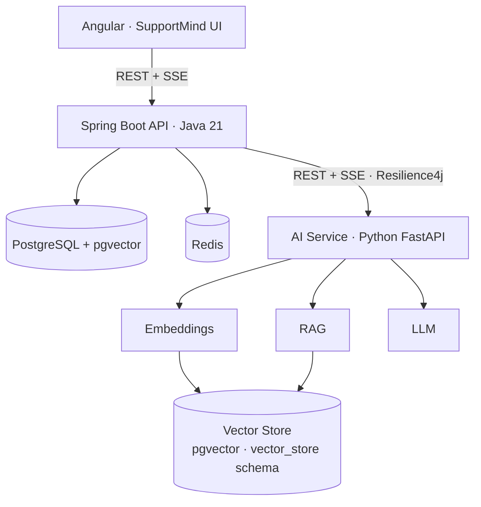
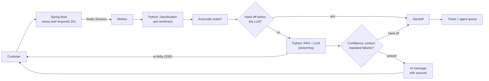
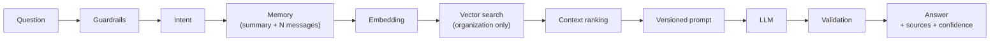
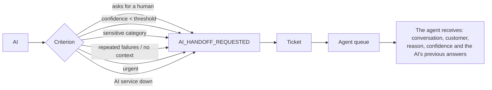
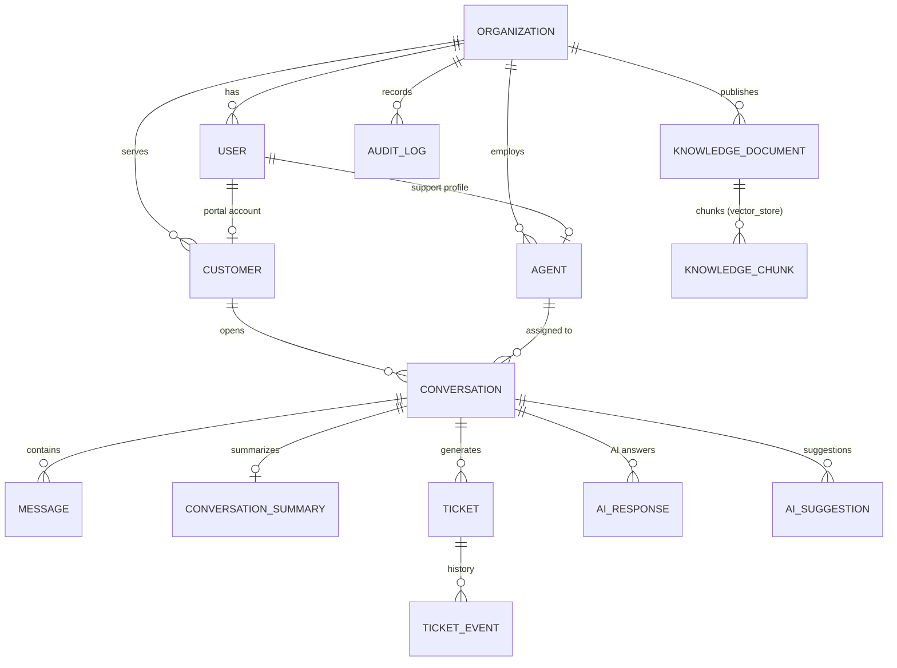

[🇪🇸 Español](README.md) | **🇬🇧 English**

# SupportMind AI — Intelligent Customer Support Platform


A SaaS customer support platform where **Java + Spring Boot** is the main system (users, organizations,
customers, conversations, tickets, knowledge base, security) and **Python + FastAPI** is the specialized
artificial intelligence service (embeddings, vector search, RAG, classification, sentiment, summaries and
suggestions with an LLM).

An AI assistant answers customers **with each company's own information** (RAG), shows the answer in real
time as the LLM generates it, cites its sources, knows how to say it doesn't have the information and
**hands off to a human agent** when appropriate. It isn't a chatbot: it's a multi-company support system
with tickets, agents, audit, analytics and observability.

## Contents

- [What it does](#what-it-does)
- [Architecture](#architecture)
- [Java and Python responsibilities](#java-and-python-responsibilities)
- [Processing a message](#processing-a-message)
- [RAG architecture](#rag-architecture)
- [Human handoff](#human-handoff)
- [Technologies](#technologies)
- [Data model](#data-model)
- [API](#api)
- [Local development and Docker](#local-development-and-docker)
- [Environment variables](#environment-variables)
- [Testing](#testing)
- [Observability](#observability)
- [Security](#security)
- [Multi-tenancy](#multi-tenancy)
- [Project structure](#project-structure)
- [Known limitations](#known-limitations)
- [Author](#author)
- [License](#license)

## What it does

- **Real-time conversations** (Server-Sent Events) over WEB, WhatsApp, Email and API channels, with the AI
  answer arriving **chunk by chunk** as the LLM generates it.
- **RAG answers**: the AI searches the organization's knowledge base (pgvector), answers only with that
  information, and shows the agent the sources used and its confidence level.
- **`NO_RELEVANT_CONTEXT`**: if there's no information, it asks for more details, informs the customer or
  hands off to an agent, depending on each organization's configuration.
- **Automatic classification** of every message (intent → category → priority) with a swappable strategy
  (rules, a Naive Bayes model, LLM or hybrid) and **sentiment analysis** as supporting information for
  agents.
- **Automatic tickets** when a message requires handling (refund, fraud, cancellation...) or on handoff,
  with a change history.
- Configurable **human handoff**: low confidence, explicit request, sensitive category, repeated failed
  answers or urgency. The conversation enters the agent queue with its context.
- **Suggestions for agents** ("Suggest response") that the agent accepts, edits or rejects: the AI never
  sends an answer on behalf of a human.
- **Conversation memory** (last N messages in Redis + an incremental summary) so full conversations aren't
  sent to the LLM.
- **Guardrails**: prompt injection blocked before the LLM, prompts with explicit rules and answer
  validation (invented figures, prompt leakage).
- **Versioned prompts** outside the code (`customer_response_v1`, `customer_response_v2`...).
- Strict **multi-tenancy**, **RBAC** (ADMIN, SUPERVISOR, AGENT, CUSTOMER), **audit** and **analytics** for
  supervisors.
- **Resilience**: if Python doesn't respond, Retry → Circuit Breaker → an "AI temporarily unavailable"
  fallback and the conversation continues with a human.

## Architecture



| Service | Port (host) | Description |
|---|---|---|
| `frontend` | 4310 | Angular served by nginx (`/api` proxy, unbuffered SSE) |
| `java-api` | 127.0.0.1:8097 | Main API, Swagger at `/swagger-ui.html` |
| `python-ai` | — (internal network only) | AI service, only reachable by the backend |
| `postgres` | 127.0.0.1:5460 | Business data + embeddings (pgvector 0.8.1) |
| `redis` | 127.0.0.1:6392 | Memory, cache, rate limiting, idempotency, job queue, pub/sub |
| `prometheus` | 127.0.0.1:9097 | Metrics |
| `grafana` | 127.0.0.1:3007 | "SupportMind AI - Overview" dashboard |
| `ollama` (profile) | — | Optional local LLM and embeddings |

Component details and design decisions in [docs/architecture.md](docs/architecture.md).

## Java and Python responsibilities

| Java (Spring Boot) → business | Python (FastAPI) → AI |
|---|---|
| Authentication (JWT) and authorization (RBAC) | Embeddings (`EmbeddingService`) |
| Organizations, users, customers, agents | Semantic search (`VectorSearchService`) |
| Conversations, messages, history | RAG: context, ranking, prompt, validation |
| Tickets, categories, priorities, states | Intent, category and priority classification |
| Knowledge base (source of truth) | Sentiment analysis |
| Handoff decision and automatic tickets | Conversation summaries |
| Audit and business metrics | Suggestions for agents |
| Asynchronous and real-time orchestration | LLM integration (`LlmService`) |

Python **doesn't handle users or authentication**: it receives the organization that Java gets from the
authenticated user and returns signals (intent, confidence, status). Java decides what to do with them
according to each company's configuration. The integration is always
**Controller → Service → AiServiceClient → FastAPI**.

## Processing a message



1. The message is stored and the request ends (with idempotency and rate limiting).
2. A worker (Redis Streams queue, at-least-once delivery) asks Python for the classification and
   sentiment, which are kept in the message metadata for the agent.
3. If the intent requires it, a ticket is created (or escalated).
4. If the AI is handling the conversation, Java requests the answer in streaming mode and forwards each
   chunk to the browser over SSE. Only one answer at a time per conversation (`ai:processing:{id}` in
   Redis).
5. The handoff policy decides whether the answer is sent or the conversation moves to an agent.

Detailed sequence diagrams in [docs/sequence-diagrams.md](docs/sequence-diagrams.md).

## RAG architecture



- **Indexing**: when a document is published, Java queues its indexing; Python splits it into chunks
  (respecting sentences and headings, with overlap), generates the embeddings and stores them in pgvector.
  When it's archived they're removed; a reconciler guarantees the AI never keeps using an archived
  document.
- **Without enough information** the answer is `NO_RELEVANT_CONTEXT` and nothing is ever made up.
- **Validation**: an answer with figures that aren't in the context (prices, time frames) or that
  reproduces the prompt is replaced with an extractive answer.
- **Without an LLM** the service keeps working with extractive answers that cite the source.
- **Swappable providers**: `EmbeddingService`, `VectorStore`, `LlmService`, `IntentClassifier`,
  `SentimentAnalyzer` and `PromptTemplateService` are abstractions; pgvector can be replaced by Qdrant,
  Pinecone or Weaviate without touching the rest.

All the details (chunking, confidence formula, guardrails, streaming) in [docs/rag.md](docs/rag.md).

## Human handoff



Each organization configures the confidence threshold, what to do without context, how many consecutive
failures are tolerated, the sensitive categories and whether urgent cases always go to a human.

## Technologies

| Area | Technologies |
|---|---|
| Backend | Java 21, Spring Boot 3.5 (Web, Security, Data JPA, Data Redis, Validation, Actuator, Cache), Flyway, JJWT, Resilience4j, springdoc-openapi |
| AI | Python 3.12, FastAPI, Pydantic, httpx, psycopg 3, prometheus-client |
| Data | PostgreSQL 16 + pgvector 0.8 (HNSW, iterative scan), Redis 7 (Streams, Pub/Sub) |
| LLM and embeddings | Any OpenAI-compatible API; local Ollama (`qwen2.5:1.5b`, `paraphrase-multilingual`) |
| Frontend | Angular 21 (standalone, signals), nginx |
| Observability | Micrometer, Prometheus, Grafana, JSON logs with correlation ID |
| Testing | JUnit 5, Mockito, Spring Boot Test, Testcontainers, WireMock, Awaitility, pytest, httpx, ruff |

## Data model



- UUID keys, timestamps, foreign keys, `CHECK` constraints on states and indexes on `organization_id`,
  `conversation_id`, `customer_id`, ticket status and `created_at`
  ([V1__initial_schema.sql](backend-java/src/main/resources/db/migration/V1__initial_schema.sql)).
- A partial unique index guarantees **a single open ticket per conversation** even if two processes create
  it at the same time.
- `knowledge_chunks` lives in the `vector_store` schema, managed by the AI service with its own role, with
  an HNSW (cosine) index.

## API

Interactive documentation: `http://localhost:8097/swagger-ui.html`. Summary in [docs/api.md](docs/api.md).

```http
POST /api/v1/auth/register            POST /api/v1/auth/login
GET  /api/v1/customers                POST /api/v1/customers
GET  /api/v1/conversations            POST /api/v1/conversations
GET  /api/v1/conversations/{id}       POST /api/v1/conversations/{id}/messages
GET  /api/v1/conversations/{id}/events   (SSE)
GET  /api/v1/tickets                  POST /api/v1/tickets        PATCH /api/v1/tickets/{id}
GET  /api/v1/knowledge                POST /api/v1/knowledge      PUT   /api/v1/knowledge/{id}
POST /api/v1/conversations/{id}/ai/reply
POST /api/v1/conversations/{id}/ai/suggest
GET  /api/v1/analytics
```

Example (with the demo data, whose knowledge base is in Spanish):

```bash
TOKEN=$(curl -s localhost:8097/api/v1/auth/login -H 'Content-Type: application/json' \
  -d '{"email":"customer@acme-store.example","password":"<DEMO_USER_PASSWORD>"}' | jq -r .accessToken)

# Open a conversation: the AI answers in the background (and streams over SSE)
curl -s localhost:8097/api/v1/conversations -H "Authorization: Bearer $TOKEN" \
  -H 'Content-Type: application/json' \
  -d '{"message":"¿En cuántos días puedo pedir el reembolso de un producto?"}'
```

AI answer (excerpt from `GET /api/v1/conversations/{id}`, with `qwen2.5:1.5b`):

```json
{
  "senderType": "AI",
  "content": "Según nuestra política de reembolsos, puedes solicitar el reembolso de un producto dentro de los 30 días calendario siguientes a la entrega...",
  "metadata": {
    "ai": {
      "status": "ANSWERED",
      "confidence": 0.948,
      "sources": [{ "title": "Política de reembolsos", "documentType": "POLICY", "score": 0.8466 }],
      "model": "qwen2.5:1.5b",
      "promptVersion": "customer_response_v2"
    }
  }
}
```

## Local development and Docker

Requirements: Docker and Docker Compose.

```bash
cp .env.example .env
# Fill in POSTGRES_PASSWORD, VECTOR_DB_PASSWORD, JWT_SECRET, AI_SERVICE_API_KEY and GRAFANA_ADMIN_PASSWORD
# (optional) DEMO_DATA_ENABLED=true and DEMO_USER_PASSWORD to load the sample company
docker compose up -d --build
```

- Frontend: <http://localhost:4310>
- Swagger: <http://localhost:8097/swagger-ui.html>
- Grafana: <http://localhost:3007> (user `admin`)

Without an LLM, the system works with local hashing embeddings and extractive answers.

### With a local LLM and embeddings (Ollama)

```bash
# In .env:
#   LLM_BASE_URL=http://ollama:11434/v1
#   LLM_MODEL=qwen2.5:1.5b
#   EMBEDDING_PROVIDER=openai
#   EMBEDDING_MODEL=paraphrase-multilingual
docker compose --profile ollama up -d --build
docker compose --profile ollama run --rm ollama-pull   # downloads the models (once)
```

With OpenAI or another compatible provider, `LLM_BASE_URL`, `LLM_MODEL` and `LLM_API_KEY` are enough.

### Demo data

With `DEMO_DATA_ENABLED=true` the **Acme Store** organization (code `acme-store`) is created with a
knowledge base of 7 documents (refunds, shipping, warranty, payments, product manual, account recovery and
FAQ) and these users, all with the password `DEMO_USER_PASSWORD`:

| User | Role |
|---|---|
| `admin@acme-store.example` | ADMIN |
| `supervisor@acme-store.example` | SUPERVISOR |
| `agent@acme-store.example`, `agent2@acme-store.example` | AGENT |
| `customer@acme-store.example` | CUSTOMER |

### Running without Docker

```bash
# Infrastructure
docker compose up -d postgres redis
# AI service
cd ai-service && pip install -r requirements-dev.txt
VECTOR_DB_PORT=5460 VECTOR_DB_PASSWORD=... AI_SERVICE_API_KEY=... uvicorn app.main:create_app --factory --port 8000
# Backend
cd backend-java && POSTGRES_PORT=5460 REDIS_PORT=6392 JWT_SECRET=... AI_SERVICE_API_KEY=... ./mvnw spring-boot:run
# Frontend (proxy to the API on port 8097)
cd frontend && npm ci && npm start
```

## Environment variables

They're all documented in [.env.example](.env.example). Real secrets are never included.

| Variable | Description |
|---|---|
| `POSTGRES_DB`, `POSTGRES_USER`, `POSTGRES_PASSWORD` | Business database |
| `VECTOR_DB_USER`, `VECTOR_DB_PASSWORD` | AI service role (`vector_store` schema only) |
| `REDIS_HOST`, `REDIS_PORT` | Redis |
| `JWT_SECRET` | HMAC secret for the JWTs (≥ 32 bytes) |
| `AI_SERVICE_URL`, `AI_SERVICE_API_KEY` | AI service URL and internal key (≥ 32 characters) |
| `LLM_API_KEY`, `LLM_MODEL`, `LLM_BASE_URL` | OpenAI-compatible LLM provider (empty = no LLM) |
| `EMBEDDING_PROVIDER`, `EMBEDDING_MODEL`, `EMBEDDING_DIMENSIONS` | `hash` (local) or `openai` (OpenAI, Ollama...) |
| `VECTOR_SEARCH_TOP_K` | Context chunks per answer |
| `RAG_MIN_SCORE` | Minimum similarity for a chunk to count as relevant (defaults depend on the provider) |
| `AI_CONFIDENCE_THRESHOLD` | Default confidence threshold for new organizations |
| `DEMO_DATA_ENABLED`, `DEMO_USER_PASSWORD` | Demo data |
| `GRAFANA_ADMIN_PASSWORD` | Grafana password |

## Testing

```bash
# Backend: unit + integration with Testcontainers (PostgreSQL + pgvector, Redis) and WireMock
cd backend-java && ./mvnw test

# Backend against the real AI service: builds the Python image and tests Java -> Python -> pgvector
cd backend-java && ./mvnw test -Pai-service-it

# AI service: pytest + ruff inside its test image
docker build --target test -t supportmind-ai-test ai-service && docker run --rm supportmind-ai-test

# Vector store tests against a real PostgreSQL + pgvector
docker network create sm-test
docker run -d --rm --name sm-pgvector --network sm-test -e POSTGRES_PASSWORD=test pgvector/pgvector:0.8.1-pg16
docker run --rm --network sm-test -e PGVECTOR_TEST_DSN="host=sm-pgvector user=postgres password=test" \
  supportmind-ai-test pytest -m pgvector
```

| Suite | What it covers |
|---|---|
| Backend (74 tests) | Authentication, role authorization, multi-tenancy, conversations, messages, tickets and history, knowledge base and indexing, RAG (through the AI service contract), SSE streaming, human handoff, fallbacks (retries, timeouts, circuit breaker), suggestions, summary, rate limiting, idempotency, analytics and domain rules |
| Backend `-Pai-service-it` (1 test) | Real full flow: indexing, semantic search, RAG answer, isolation between organizations and document removal |
| AI service (74 tests) | RAG pipeline, streaming, guardrails, answer validation, classification (rules, Naive Bayes, LLM, hybrid), sentiment, chunking, embeddings, prompts, API and metrics |
| pgvector (4 tests) | Search with per-organization isolation, HNSW with filters, reindexing, incompatible dimensions and database down |

## Observability

- **Metrics** (Prometheus): `ai_requests_total`, `ai_errors_total`, `ai_latency_seconds`,
  `rag_search_latency_seconds`, `llm_latency_seconds`, `human_handoff_total`, `conversation_created_total`,
  `ticket_created_total`, plus HTTP, JVM, connection pool and circuit breaker state.
  `conversation_created_total` and `ticket_created_total` are produced with recording rules
  ([rules.yml](infrastructure/prometheus/rules.yml)): OpenMetrics reserves the `_created` suffix.
- A provisioned **Grafana dashboard**: business, AI calls, RAG and LLM latencies, answer validation and
  circuit breaker.
- **Structured JSON logs** in both services with `correlation_id`: the same identifier follows a request
  from Angular to Java, to Python and to the LLM (`X-Correlation-Id` header, also in async jobs).
- Business **audit**: `USER_LOGIN`, `CONVERSATION_CREATED`, `MESSAGE_SENT`, `AI_RESPONSE_GENERATED`,
  `AI_HANDOFF`, `TICKET_CREATED`, `TICKET_UPDATED`, `KNOWLEDGE_DOCUMENT_CREATED/UPDATED`,
  `AI_SUGGESTION_ACCEPTED/REJECTED`, among others.

## Security

- **Spring Security + JWT**: a 15-minute access token signed with HS256 and a rotating opaque refresh token
  (only its hash is stored in Redis; a used token can't be reused).
- **RBAC** with four roles, applied by URL and on each endpoint (`@PreAuthorize`), plus ownership rules in
  the services (an agent only sees their conversations and the queue; a customer, only their own).
- **Isolated AI service**: it isn't published outside the Docker network, requires an internal key
  (compared in constant time) and its database role can't read business data.
- **Rate limiting** on login, message creation, AI operations and semantic search.
- **Idempotency** on message sending; RFC 7807 errors without stack traces or internal data.
- **AI guardrails**: prompt injection, rules in the prompt, answer validation and per-organization
  isolation of vector search.
- nginx with security headers (CSP, `X-Frame-Options`, `nosniff`); the actuator isn't exposed.
- Secrets only through environment variables; `.env` excluded from git; no secret appears in the logs.

## Multi-tenancy

Every customer, agent, conversation, ticket and document belongs to an organization. Every query filters
by the authenticated user's organization, someone else's resource responds `404`, vector search requires
the organization on every call and real-time events are filtered with the same rules before reaching each
connection. The integration tests check it resource by resource, and the test against the real AI service
checks it in pgvector.

## Project structure

```text
intelligent-customer-support/
├── backend-java/      Main API (Spring Boot): auth, organization, customer, agent, conversation,
│                      message, ticket, knowledge, ai, realtime, analytics, audit, config, exception
├── ai-service/        AI service (FastAPI): api, core, models, services, rag, embeddings, llm, prompts
├── frontend/          Angular: login, dashboard, inbox, conversation, customers, tickets, knowledge
│                      base, analytics and settings
├── infrastructure/    postgres (vector store role), prometheus (scrape and rules), grafana (dashboard)
├── docs/              architecture.md, rag.md, api.md, sequence-diagrams.md
├── docker-compose.yml
├── .env.example
├── README.md
└── LICENSE
```

## Known limitations

- **Small local model**: with `qwen2.5:1.5b` on CPU the first part of an answer takes about 8-10 s and
  quality is limited (it follows the context well, but with ambiguous questions it can fall short). For
  production a larger model or an external provider is recommended; changing the `LLM_*` variables is
  enough.
- **Hashing embeddings** (dependency-free mode): lexical matches only, no synonyms. With
  `paraphrase-multilingual` search is semantic and multilingual. `nomic-embed-text` was tried and in
  Spanish it doesn't separate relevant from unrelated content (see [docs/rag.md](docs/rag.md)).
- **The similarity threshold depends on the embedding model**: the defaults were measured with the demo
  knowledge base; with another model it should be measured (`RAG_MIN_SCORE`).
- **WhatsApp and Email channels**: conversations and messages are managed on the platform, but actual
  delivery needs an external provider; the extension point is `ChannelGateway` (today it only records the
  send).
- **Answer validation** is heuristic (figures and prompt fragments): it reduces fabrications but doesn't
  eliminate them completely. With `qwen2.5:1.5b` it replaces some answers with an extractive one: in
  testing, for a question about Bluetooth the model added figures that weren't in the manual and the
  customer received the manual's literal steps instead.
- The Naive Bayes classifier's corpus is small (demo); in production it would be trained on real labelled
  conversations.
- An archived document is removed from the vector store asynchronously (seconds, or up to 5 minutes if the
  AI service was down).
- Prometheus and Grafana are configured for development.

## Author

- **LinkedIn:** [samuel-martinez-beleno](https://www.linkedin.com/in/samuel-martinez-beleno/)
- **GitHub:** [samsenpro](https://github.com/samsenpro)

## License

Distributed under the MIT license. See the [LICENSE](LICENSE) file.
