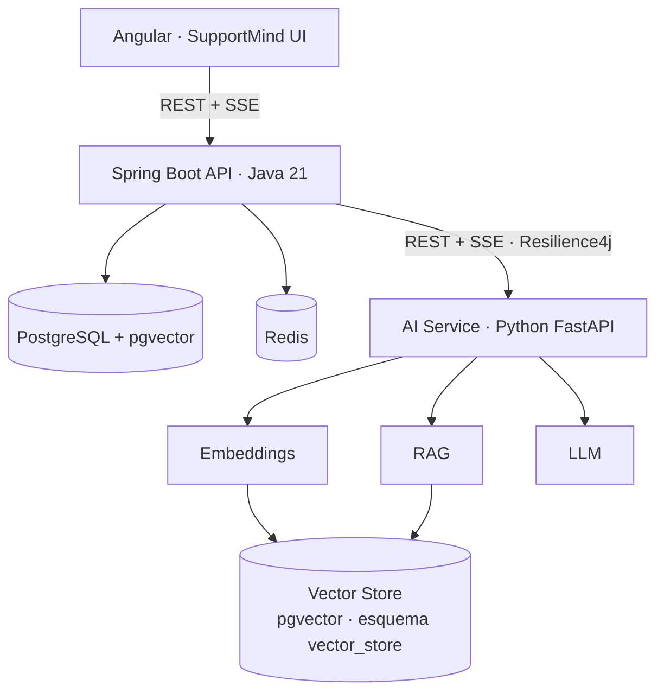
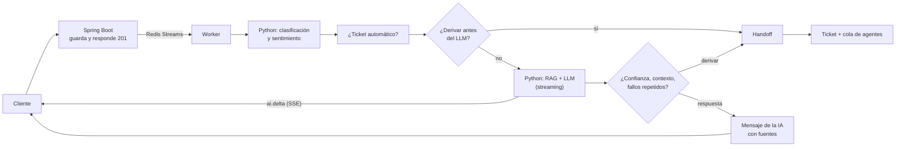
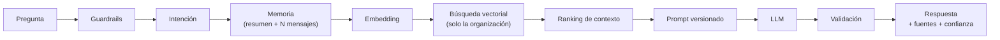
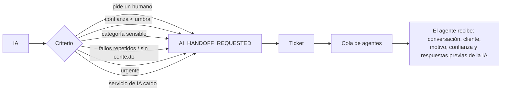
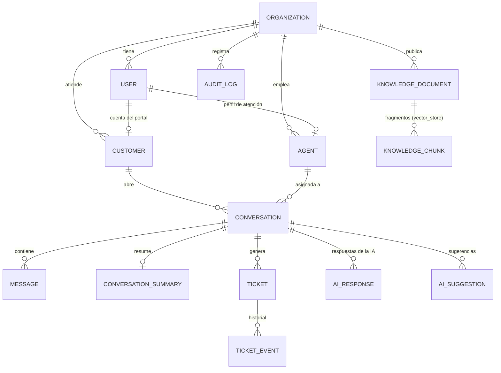

# SupportMind AI — Intelligent Customer Support Platform


Plataforma SaaS de atención al cliente donde **Java + Spring Boot** es el sistema principal (usuarios,
organizaciones, clientes, conversaciones, tickets, base de conocimiento, seguridad) y **Python + FastAPI**
es el servicio especializado de inteligencia artificial (embeddings, búsqueda vectorial, RAG,
clasificación, sentimiento, resúmenes y sugerencias con un LLM).

Un asistente de IA responde a los clientes **con la información propia de cada empresa** (RAG), muestra
la respuesta en tiempo real mientras el LLM la genera, cita sus fuentes, sabe decir que no tiene
información y **deriva a un agente humano** cuando corresponde. No es un chatbot: es un sistema de
soporte multi-empresa con tickets, agentes, auditoría, analítica y observabilidad.

## Contenido

- [Qué hace](#qué-hace)
- [Arquitectura](#arquitectura)
- [Responsabilidades de Java y Python](#responsabilidades-de-java-y-python)
- [Procesamiento de un mensaje](#procesamiento-de-un-mensaje)
- [Arquitectura RAG](#arquitectura-rag)
- [Escalamiento a humano](#escalamiento-a-humano)
- [Tecnologías](#tecnologías)
- [Modelo de datos](#modelo-de-datos)
- [API](#api)
- [Desarrollo local y Docker](#desarrollo-local-y-docker)
- [Variables de entorno](#variables-de-entorno)
- [Testing](#testing)
- [Observabilidad](#observabilidad)
- [Seguridad](#seguridad)
- [Multi-tenancy](#multi-tenancy)
- [Estructura del proyecto](#estructura-del-proyecto)
- [Limitaciones conocidas](#limitaciones-conocidas)
- [Autor](#autor)
- [Licencia](#licencia)

## Qué hace

- **Conversaciones en tiempo real** (Server-Sent Events) por canales WEB, WhatsApp, Email y API, con la
  respuesta de la IA llegando **fragmento a fragmento** mientras el LLM la genera.
- **Respuestas con RAG**: la IA busca en la base de conocimiento de la organización (pgvector), responde
  solo con esa información, muestra al agente las fuentes usadas y su nivel de confianza.
- **`NO_RELEVANT_CONTEXT`**: si no hay información, pide más detalles, informa o deriva a un agente,
  según la configuración de cada organización.
- **Clasificación automática** de cada mensaje (intención → categoría → prioridad) con una estrategia
  intercambiable (reglas, modelo Naive Bayes, LLM o híbrida) y **análisis de sentimiento** como información
  auxiliar para los agentes.
- **Tickets automáticos** cuando un mensaje requiere gestión (reembolso, fraude, cancelación...) o al
  derivar, con historial de cambios.
- **Escalamiento a humano** configurable: confianza baja, petición explícita, categoría sensible,
  respuestas fallidas repetidas o urgencia. La conversación entra en la cola de agentes con su contexto.
- **Sugerencias para agentes** ("Suggest response") que el agente acepta, edita o rechaza: la IA nunca
  envía una respuesta en nombre de un humano.
- **Memoria de conversación** (últimos N mensajes en Redis + resumen incremental) para no enviar al LLM
  conversaciones completas.
- **Guardrails**: prompt injection bloqueado antes del LLM, prompts con reglas explícitas y validación
  de la respuesta (cifras inventadas, fuga del prompt).
- **Prompts versionados** fuera del código (`customer_response_v1`, `customer_response_v2`...).
- **Multi-tenancy** estricto, **RBAC** (ADMIN, SUPERVISOR, AGENT, CUSTOMER), **auditoría** y **analítica**
  para supervisores.
- **Resiliencia**: si Python no responde, Retry → Circuit Breaker → fallback "AI temporarily unavailable"
  y la conversación continúa con un humano.

## Arquitectura



| Servicio | Puerto (host) | Descripción |
|---|---|---|
| `frontend` | 4310 | Angular servido por nginx (proxy de `/api`, SSE sin buffering) |
| `java-api` | 127.0.0.1:8097 | API principal, Swagger en `/swagger-ui.html` |
| `python-ai` | — (solo red interna) | Servicio de IA, solo accesible por el backend |
| `postgres` | 127.0.0.1:5460 | Datos de negocio + embeddings (pgvector 0.8.1) |
| `redis` | 127.0.0.1:6392 | Memoria, caché, rate limiting, idempotencia, cola de jobs, pub/sub |
| `prometheus` | 127.0.0.1:9097 | Métricas |
| `grafana` | 127.0.0.1:3007 | Dashboard "SupportMind AI - Overview" |
| `ollama` (perfil) | — | LLM y embeddings locales opcionales |

Detalle de componentes y decisiones de diseño en [docs/architecture.md](docs/architecture.md).

## Responsabilidades de Java y Python

| Java (Spring Boot) → negocio | Python (FastAPI) → IA |
|---|---|
| Autenticación (JWT) y autorización (RBAC) | Embeddings (`EmbeddingService`) |
| Organizaciones, usuarios, clientes, agentes | Búsqueda semántica (`VectorSearchService`) |
| Conversaciones, mensajes, historial | RAG: contexto, ranking, prompt, validación |
| Tickets, categorías, prioridades, estados | Clasificación de intención, categoría y prioridad |
| Base de conocimiento (fuente de verdad) | Análisis de sentimiento |
| Decisión de escalamiento y tickets automáticos | Resúmenes de conversación |
| Auditoría y métricas de negocio | Sugerencias para agentes |
| Orquestación asíncrona y tiempo real | Integración con el LLM (`LlmService`) |

Python **no maneja usuarios ni autenticación**: recibe la organización que Java obtiene del usuario
autenticado y devuelve señales (intención, confianza, estado). Java decide qué hacer con ellas según la
configuración de cada empresa. La integración es siempre **Controller → Service → AiServiceClient → FastAPI**.

## Procesamiento de un mensaje



1. El mensaje se guarda y la petición termina (con idempotencia y rate limiting).
2. Un worker (cola en Redis Streams, entrega al menos una vez) pide a Python la clasificación y el
   sentimiento, que quedan en los metadatos del mensaje para el agente.
3. Si la intención lo requiere, se crea (o escala) un ticket.
4. Si la conversación la atiende la IA, Java pide la respuesta en streaming y reenvía cada fragmento al
   navegador por SSE. Solo una respuesta a la vez por conversación (`ai:processing:{id}` en Redis).
5. La política de escalamiento decide si la respuesta se envía o la conversación pasa a un agente.

Diagramas de secuencia detallados en [docs/sequence-diagrams.md](docs/sequence-diagrams.md).

## Arquitectura RAG



- **Indexación**: al publicar un documento, Java encola su indexación; Python lo divide en fragmentos
  (respetando frases y títulos, con solapamiento), genera los embeddings y los guarda en pgvector. Al
  archivarlo se retiran; un reconciliador garantiza que la IA nunca siga usando un documento archivado.
- **Sin información suficiente** la respuesta es `NO_RELEVANT_CONTEXT` y nunca se inventa nada.
- **Validación**: una respuesta con cifras que no están en el contexto (precios, plazos) o que reproduce
  el prompt se sustituye por una respuesta extractiva.
- **Sin LLM** el servicio sigue funcionando con respuestas extractivas que citan la fuente.
- **Proveedores intercambiables**: `EmbeddingService`, `VectorStore`, `LlmService`, `IntentClassifier`,
  `SentimentAnalyzer` y `PromptTemplateService` son abstracciones; pgvector se puede sustituir por Qdrant,
  Pinecone o Weaviate sin tocar el resto.

Todo el detalle (chunking, fórmula de confianza, guardrails, streaming) en [docs/rag.md](docs/rag.md).

## Escalamiento a humano



Cada organización configura el umbral de confianza, qué hacer sin contexto, cuántos fallos seguidos se
toleran, las categorías sensibles y si lo urgente va siempre a un humano.

## Tecnologías

| Área | Tecnologías |
|---|---|
| Backend | Java 21, Spring Boot 3.5 (Web, Security, Data JPA, Data Redis, Validation, Actuator, Cache), Flyway, JJWT, Resilience4j, springdoc-openapi |
| IA | Python 3.12, FastAPI, Pydantic, httpx, psycopg 3, prometheus-client |
| Datos | PostgreSQL 16 + pgvector 0.8 (HNSW, escaneo iterativo), Redis 7 (Streams, Pub/Sub) |
| LLM y embeddings | Cualquier API compatible con OpenAI; Ollama local (`qwen2.5:1.5b`, `paraphrase-multilingual`) |
| Frontend | Angular 21 (standalone, signals), nginx |
| Observabilidad | Micrometer, Prometheus, Grafana, logs JSON con correlation ID |
| Testing | JUnit 5, Mockito, Spring Boot Test, Testcontainers, WireMock, Awaitility, pytest, httpx, ruff |

## Modelo de datos



- Claves UUID, marcas de tiempo, claves foráneas, restricciones `CHECK` sobre los estados e índices por
  `organization_id`, `conversation_id`, `customer_id`, estado del ticket y `created_at`
  ([V1__initial_schema.sql](backend-java/src/main/resources/db/migration/V1__initial_schema.sql)).
- Un índice único parcial garantiza **un solo ticket abierto por conversación** aunque dos procesos lo
  creen a la vez.
- `knowledge_chunks` vive en el esquema `vector_store`, gestionado por el servicio de IA con su propio rol,
  con un índice HNSW (coseno).

## API

Documentación interactiva: `http://localhost:8097/swagger-ui.html`. Resumen en [docs/api.md](docs/api.md).

```http
POST /api/v1/auth/register            POST /api/v1/auth/login
GET  /api/v1/customers                POST /api/v1/customers
GET  /api/v1/conversations            POST /api/v1/conversations
GET  /api/v1/conversations/{id}       POST /api/v1/conversations/{id}/messages
GET  /api/v1/conversations/{id}/events   (SSE)
GET  /api/v1/tickets                  POST /api/v1/tickets        PATCH /api/v1/tickets/{id}
GET  /api/v1/knowledge                POST /api/v1/knowledge      PUT   /api/v1/knowledge/{id}
POST /api/v1/conversations/{id}/ai/reply
POST /api/v1/conversations/{id}/ai/suggest
GET  /api/v1/analytics
```

Ejemplo (con los datos de demostración):

```bash
TOKEN=$(curl -s localhost:8097/api/v1/auth/login -H 'Content-Type: application/json' \
  -d '{"email":"customer@acme-store.example","password":"<DEMO_USER_PASSWORD>"}' | jq -r .accessToken)

# Abre una conversación: la IA responde en segundo plano (y en streaming por SSE)
curl -s localhost:8097/api/v1/conversations -H "Authorization: Bearer $TOKEN" \
  -H 'Content-Type: application/json' \
  -d '{"message":"¿En cuántos días puedo pedir el reembolso de un producto?"}'
```

Respuesta de la IA (fragmento de `GET /api/v1/conversations/{id}`, con `qwen2.5:1.5b`):

```json
{
  "senderType": "AI",
  "content": "Según nuestra política de reembolsos, puedes solicitar el reembolso de un producto dentro de los 30 días calendario siguientes a la entrega...",
  "metadata": {
    "ai": {
      "status": "ANSWERED",
      "confidence": 0.948,
      "sources": [{ "title": "Política de reembolsos", "documentType": "POLICY", "score": 0.8466 }],
      "model": "qwen2.5:1.5b",
      "promptVersion": "customer_response_v2"
    }
  }
}
```

## Desarrollo local y Docker

Requisitos: Docker y Docker Compose.

```bash
cp .env.example .env
# Rellena POSTGRES_PASSWORD, VECTOR_DB_PASSWORD, JWT_SECRET, AI_SERVICE_API_KEY y GRAFANA_ADMIN_PASSWORD
# (opcional) DEMO_DATA_ENABLED=true y DEMO_USER_PASSWORD para cargar la empresa de ejemplo
docker compose up -d --build
```

- Frontend: <http://localhost:4310>
- Swagger: <http://localhost:8097/swagger-ui.html>
- Grafana: <http://localhost:3007> (usuario `admin`)

Sin LLM, el sistema funciona con embeddings locales por hashing y respuestas extractivas.

### Con LLM y embeddings locales (Ollama)

```bash
# En .env:
#   LLM_BASE_URL=http://ollama:11434/v1
#   LLM_MODEL=qwen2.5:1.5b
#   EMBEDDING_PROVIDER=openai
#   EMBEDDING_MODEL=paraphrase-multilingual
docker compose --profile ollama up -d --build
docker compose --profile ollama run --rm ollama-pull   # descarga los modelos (una vez)
```

Con OpenAI u otro proveedor compatible basta con `LLM_BASE_URL`, `LLM_MODEL` y `LLM_API_KEY`.

### Datos de demostración

Con `DEMO_DATA_ENABLED=true` se crea la organización **Acme Store** (código `acme-store`) con una base de
conocimiento de 7 documentos (reembolsos, envíos, garantía, pagos, manual de producto, recuperación de
cuenta y FAQ) y estos usuarios, todos con la contraseña `DEMO_USER_PASSWORD`:

| Usuario | Rol |
|---|---|
| `admin@acme-store.example` | ADMIN |
| `supervisor@acme-store.example` | SUPERVISOR |
| `agent@acme-store.example`, `agent2@acme-store.example` | AGENT |
| `customer@acme-store.example` | CUSTOMER |

### Ejecución sin Docker

```bash
# Infraestructura
docker compose up -d postgres redis
# Servicio de IA
cd ai-service && pip install -r requirements-dev.txt
VECTOR_DB_PORT=5460 VECTOR_DB_PASSWORD=... AI_SERVICE_API_KEY=... uvicorn app.main:create_app --factory --port 8000
# Backend
cd backend-java && POSTGRES_PORT=5460 REDIS_PORT=6392 JWT_SECRET=... AI_SERVICE_API_KEY=... ./mvnw spring-boot:run
# Frontend (proxy a la API en el puerto 8097)
cd frontend && npm ci && npm start
```

## Variables de entorno

Todas están documentadas en [.env.example](.env.example). Nunca se incluyen secretos reales.

| Variable | Descripción |
|---|---|
| `POSTGRES_DB`, `POSTGRES_USER`, `POSTGRES_PASSWORD` | Base de datos de negocio |
| `VECTOR_DB_USER`, `VECTOR_DB_PASSWORD` | Rol del servicio de IA (solo esquema `vector_store`) |
| `REDIS_HOST`, `REDIS_PORT` | Redis |
| `JWT_SECRET` | Secreto HMAC de los JWT (≥ 32 bytes) |
| `AI_SERVICE_URL`, `AI_SERVICE_API_KEY` | URL y clave interna del servicio de IA (≥ 32 caracteres) |
| `LLM_API_KEY`, `LLM_MODEL`, `LLM_BASE_URL` | Proveedor LLM compatible con OpenAI (vacío = sin LLM) |
| `EMBEDDING_PROVIDER`, `EMBEDDING_MODEL`, `EMBEDDING_DIMENSIONS` | `hash` (local) u `openai` (OpenAI, Ollama...) |
| `VECTOR_SEARCH_TOP_K` | Fragmentos de contexto por respuesta |
| `RAG_MIN_SCORE` | Similitud mínima para considerar relevante un fragmento (por defecto según el proveedor) |
| `AI_CONFIDENCE_THRESHOLD` | Umbral de confianza por defecto de las organizaciones nuevas |
| `DEMO_DATA_ENABLED`, `DEMO_USER_PASSWORD` | Datos de demostración |
| `GRAFANA_ADMIN_PASSWORD` | Contraseña de Grafana |

## Testing

```bash
# Backend: unitarios + integración con Testcontainers (PostgreSQL + pgvector, Redis) y WireMock
cd backend-java && ./mvnw test

# Backend contra el servicio de IA real: construye la imagen de Python y prueba Java -> Python -> pgvector
cd backend-java && ./mvnw test -Pai-service-it

# Servicio de IA: pytest + ruff dentro de su imagen de tests
docker build --target test -t supportmind-ai-test ai-service && docker run --rm supportmind-ai-test

# Tests del vector store contra PostgreSQL + pgvector real
docker network create sm-test
docker run -d --rm --name sm-pgvector --network sm-test -e POSTGRES_PASSWORD=test pgvector/pgvector:0.8.1-pg16
docker run --rm --network sm-test -e PGVECTOR_TEST_DSN="host=sm-pgvector user=postgres password=test" \
  supportmind-ai-test pytest -m pgvector
```

| Suite | Qué cubre |
|---|---|
| Backend (74 tests) | Autenticación, autorización por rol, multi-tenancy, conversaciones, mensajes, tickets e historial, base de conocimiento e indexación, RAG (vía el contrato del servicio de IA), streaming SSE, escalamiento a humano, fallbacks (reintentos, timeouts, circuit breaker), sugerencias, resumen, rate limiting, idempotencia, analítica y reglas de dominio |
| Backend `-Pai-service-it` (1 test) | Flujo completo real: indexación, búsqueda semántica, respuesta RAG, aislamiento entre organizaciones y retirada de documentos |
| Servicio de IA (74 tests) | Pipeline RAG, streaming, guardrails, validación de respuestas, clasificación (reglas, Naive Bayes, LLM, híbrida), sentimiento, chunking, embeddings, prompts, API y métricas |
| pgvector (4 tests) | Búsqueda con aislamiento por organización, HNSW con filtros, reindexación, dimensiones incompatibles y base de datos caída |

## Observabilidad

- **Métricas** (Prometheus): `ai_requests_total`, `ai_errors_total`, `ai_latency_seconds`,
  `rag_search_latency_seconds`, `llm_latency_seconds`, `human_handoff_total`, `conversation_created_total`,
  `ticket_created_total`, además de HTTP, JVM, pool de conexiones y estado del circuit breaker.
  `conversation_created_total` y `ticket_created_total` se generan con reglas de grabación
  ([rules.yml](infrastructure/prometheus/rules.yml)): OpenMetrics reserva el sufijo `_created`.
- **Dashboard de Grafana** provisionado: negocio, llamadas a la IA, latencias de RAG y LLM, validación
  de respuestas y circuit breaker.
- **Logs estructurados en JSON** en ambos servicios con `correlation_id`: el mismo identificador sigue una
  petición de Angular a Java, a Python y al LLM (cabecera `X-Correlation-Id`, también en los jobs asíncronos).
- **Auditoría** de negocio: `USER_LOGIN`, `CONVERSATION_CREATED`, `MESSAGE_SENT`, `AI_RESPONSE_GENERATED`,
  `AI_HANDOFF`, `TICKET_CREATED`, `TICKET_UPDATED`, `KNOWLEDGE_DOCUMENT_CREATED/UPDATED`,
  `AI_SUGGESTION_ACCEPTED/REJECTED`, entre otros.

## Seguridad

- **Spring Security + JWT**: access token de 15 minutos firmado con HS256 y refresh token opaco rotatorio
  (en Redis solo se guarda su hash; un token usado no vuelve a servir).
- **RBAC** con cuatro roles, aplicado por URL y en cada endpoint (`@PreAuthorize`), más reglas de
  propiedad en los servicios (un agente solo ve sus conversaciones y la cola; un cliente, solo las suyas).
- **Servicio de IA aislado**: no se publica fuera de la red de Docker, exige una clave interna (comparada
  en tiempo constante) y su rol de base de datos no puede leer datos de negocio.
- **Rate limiting** en login, creación de mensajes, operaciones de IA y búsqueda semántica.
- **Idempotencia** en el envío de mensajes; errores RFC 7807 sin trazas ni datos internos.
- **Guardrails de IA**: prompt injection, reglas en el prompt, validación de la respuesta y aislamiento
  de la búsqueda vectorial por organización.
- nginx con cabeceras de seguridad (CSP, `X-Frame-Options`, `nosniff`); el actuator no se expone.
- Secretos solo por variables de entorno; `.env` excluido de git; ningún secreto aparece en los logs.

## Multi-tenancy

Cada cliente, agente, conversación, ticket y documento pertenece a una organización. Todas las consultas
filtran por la organización del usuario autenticado, un recurso ajeno responde `404`, la búsqueda
vectorial exige la organización en cada llamada y los eventos en tiempo real se filtran con las mismas
reglas antes de llegar a cada conexión. Los tests de integración lo comprueban recurso por recurso, y el
test contra el servicio de IA real lo comprueba en pgvector.

## Estructura del proyecto

```text
intelligent-customer-support/
├── backend-java/      API principal (Spring Boot): auth, organization, customer, agent, conversation,
│                      message, ticket, knowledge, ai, realtime, analytics, audit, config, exception
├── ai-service/        Servicio de IA (FastAPI): api, core, models, services, rag, embeddings, llm, prompts
├── frontend/          Angular: login, dashboard, inbox, conversación, clientes, tickets, base de
│                      conocimiento, analítica y configuración
├── infrastructure/    postgres (rol del vector store), prometheus (scrape y reglas), grafana (dashboard)
├── docs/              architecture.md, rag.md, api.md, sequence-diagrams.md
├── docker-compose.yml
├── .env.example
├── README.md
└── LICENSE
```

## Limitaciones conocidas

- **Modelo local pequeño**: con `qwen2.5:1.5b` en CPU la primera parte de una respuesta tarda unos 8-10 s
  y la calidad es limitada (sigue bien el contexto, pero con preguntas ambiguas puede quedarse corto). Para
  producción se recomienda un modelo mayor o un proveedor externo; basta con cambiar las variables `LLM_*`.
- **Embeddings por hashing** (modo sin dependencias): solo coincidencias léxicas, sin sinónimos. Con
  `paraphrase-multilingual` la búsqueda es semántica y multilingüe. `nomic-embed-text` se probó y en
  español no separa lo relevante de lo ajeno (ver [docs/rag.md](docs/rag.md)).
- **El umbral de similitud depende del modelo de embeddings**: los valores por defecto están medidos con
  la base de conocimiento de demostración; con otro modelo conviene medirlo (`RAG_MIN_SCORE`).
- **Canales WhatsApp y Email**: las conversaciones y mensajes se gestionan en la plataforma, pero el envío
  real necesita un proveedor externo; el punto de extensión es `ChannelGateway` (hoy solo registra el envío).
- La **validación de respuestas** es heurística (cifras y fragmentos del prompt): reduce las invenciones,
  no las elimina por completo. Con `qwen2.5:1.5b` sustituye algunas respuestas por una extractiva: en las
  pruebas, a una pregunta sobre Bluetooth el modelo añadió cifras que no estaban en el manual y el
  cliente recibió en su lugar los pasos literales del manual.
- El corpus del clasificador Naive Bayes es pequeño (demostración); en producción se entrenaría con
  conversaciones reales etiquetadas.
- Un documento archivado se retira del vector store de forma asíncrona (segundos, o hasta 5 minutos si el
  servicio de IA estaba caído).
- Prometheus y Grafana están configurados para desarrollo.

## Autor

- **LinkedIn:** [samuel-martinez-beleno](https://www.linkedin.com/in/samuel-martinez-beleno/)
- **GitHub:** [samsenpro](https://github.com/samsenpro)

## Licencia

Distribuido bajo la licencia MIT. Consulta el archivo [LICENSE](LICENSE).
