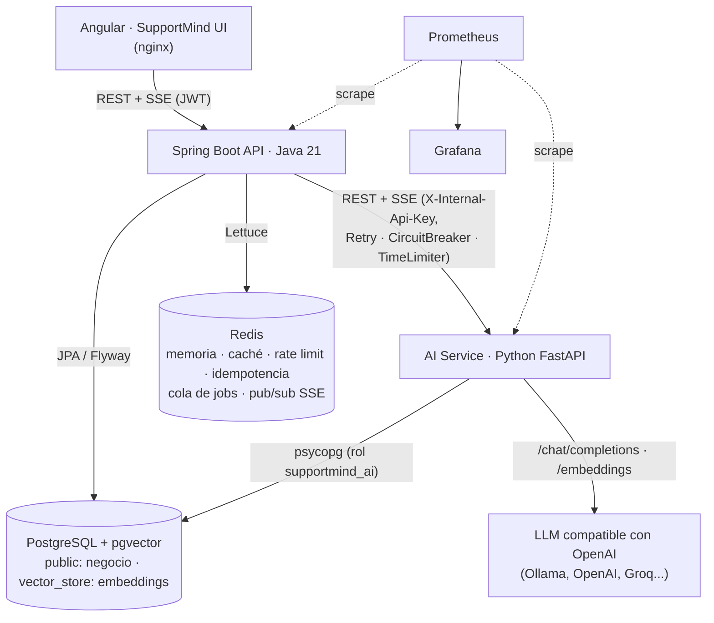

# Arquitectura

SupportMind AI separa la plataforma en dos servicios con responsabilidades claras:

| | Java (Spring Boot) | Python (FastAPI) |
|---|---|---|
| Rol | Sistema principal y fuente de verdad del negocio | Servicio especializado de IA |
| Datos | Organizaciones, usuarios, clientes, agentes, conversaciones, mensajes, tickets, historial, base de conocimiento, auditoría, métricas de negocio | Fragmentos (chunks) y embeddings en el esquema `vector_store` |
| Seguridad | Spring Security, JWT, RBAC, multi-tenancy | Clave interna compartida: solo Java puede llamarlo |
| IA | Orquesta: cuándo responde la IA, cuándo deriva, qué tickets crea | Embeddings, búsqueda semántica, RAG, clasificación, sentimiento, resumen, sugerencias, LLM |

Python **no conoce usuarios ni permisos**: recibe siempre el `organization_id` que Java obtiene del
usuario autenticado y nunca decide nada de negocio (derivar, crear tickets). Devuelve señales
(intención, confianza, estado del RAG) y Java aplica la configuración de cada organización.

## Componentes



## Paquetes del backend

```text
com.supportmind
├── auth           usuarios, roles, JWT, refresh tokens, registro y login
├── organization   organización (tenant) y su configuración de IA; miembros del equipo
├── customer       clientes (con o sin cuenta en el portal)
├── agent          perfiles de atención y disponibilidad
├── conversation   conversaciones, reglas de acceso, resúmenes, canales (ChannelGateway)
├── message        mensajes y su publicación (tiempo real, memoria, jobs)
├── ticket         tickets, transiciones, historial y tickets automáticos
├── knowledge      base de conocimiento, indexación asíncrona y reconciliación
├── ai             orquestación de la IA: respuesta, análisis, escalamiento, sugerencias, resumen
│   ├── client     contrato HTTP con Python y resiliencia (Resilience4j)
│   └── jobs       cola de jobs de IA sobre Redis Streams
├── realtime       eventos por Redis Pub/Sub y conexiones SSE
├── analytics      métricas de negocio para supervisores
├── audit          registro de auditoría
├── demo           datos de demostración opcionales
├── config         seguridad, caché, Redis, OpenAPI
├── common         utilidades transversales (rate limiting, idempotencia, correlation ID, reintentos)
└── exception      errores RFC 7807 con códigos estables
```

## Servicio de IA

```text
app/
├── api/           endpoints (chat con streaming, clasificación, sentimiento, resumen, sugerencias, conocimiento)
├── core/          configuración, errores, logging JSON, métricas, correlation ID, seguridad
├── models/        contrato Pydantic (snake_case)
├── embeddings/    EmbeddingService: hashing local u OpenAI-compatible (Ollama, OpenAI...)
├── rag/           chunking, VectorSearchService, ranking de contexto, indexación, vector store (pgvector / memoria)
├── llm/           LlmService: OpenAI-compatible con streaming, o desactivado
├── prompts/       plantillas versionadas en TOML (customer_response v1/v2, agent_suggestion...)
└── services/      pipeline de respuesta, clasificación, sentimiento, guardrails, validación, resumen, sugerencias
```

## Decisiones de diseño

- **Una sola base de datos.** PostgreSQL guarda los datos de negocio y, con pgvector, los embeddings.
  Evita operar otra base de datos. El servicio de IA usa su propio rol, dueño solo del esquema
  `vector_store`: aunque se viera comprometido no podría leer usuarios, conversaciones ni tickets.
- **VectorStore como abstracción.** Sustituir pgvector por Qdrant, Pinecone o Weaviate es implementar
  `VectorStore` en Python; ni Java ni el pipeline cambian.
- **Procesamiento asíncrono con Redis Streams.** El mensaje del cliente se guarda y responde al instante;
  el análisis y la respuesta de la IA van a una cola con grupo de consumidores (entrega al menos una vez,
  reencolado de jobs abandonados). La indexación de documentos usa la misma cola.
- **Tiempo real con SSE.** Unidireccional, sobre HTTP, compatible con proxies y con el JWT en cabecera.
  Los eventos viajan por Redis Pub/Sub, así que funciona con varias instancias de la API.
- **Una respuesta de IA a la vez por conversación.** Un marcador en Redis (`ai:processing:{id}`) evita
  respuestas concurrentes; si llegan mensajes mientras la IA responde, responde una vez más al terminar.
- **Bloqueo optimista con reintento.** La conversación la modifican a la vez el cliente, los agentes y los
  jobs de IA; `@Version` evita perder actualizaciones y `OptimisticRetry` reintenta la operación completa.
- **Canales extensibles.** WEB, WHATSAPP, EMAIL y API comparten el mismo modelo; la entrega saliente de
  cada canal es una implementación de `ChannelGateway`.
- **La IA nunca envía una respuesta humana sin configuración explícita.** Las sugerencias las revisa un
  agente; la respuesta automática al cliente depende de `autoReplyEnabled` de la organización.

## Multi-tenancy

Cada entidad de negocio lleva `organization_id`. Las consultas siempre filtran por la organización del
usuario autenticado (nunca por un parámetro de la petición), y un recurso de otra organización responde
`404` (no `403`), para no revelar que existe. La búsqueda vectorial exige la organización en cada llamada.
Los eventos SSE se filtran con las mismas reglas antes de enviarse a cada conexión.
