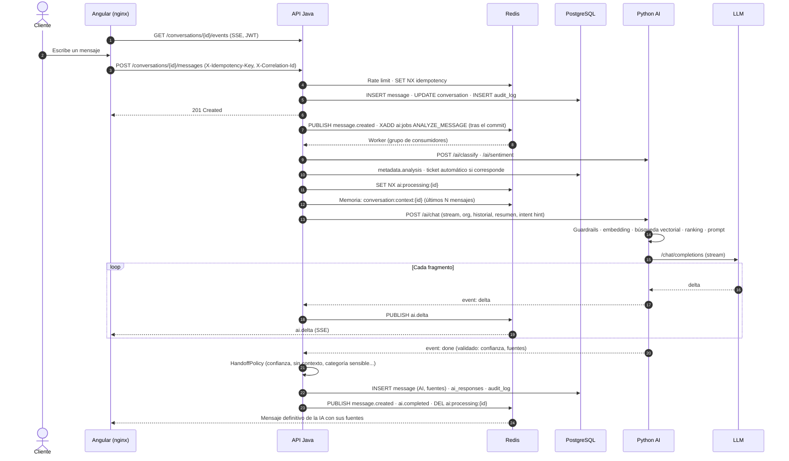
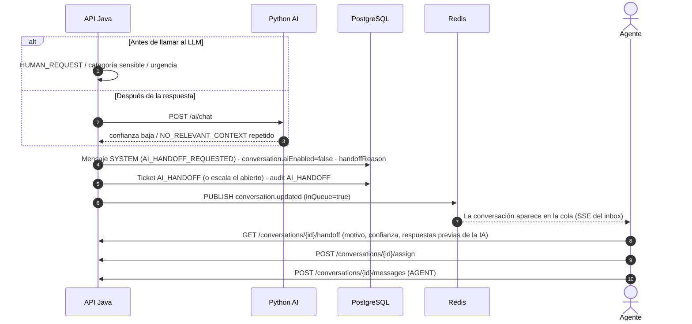
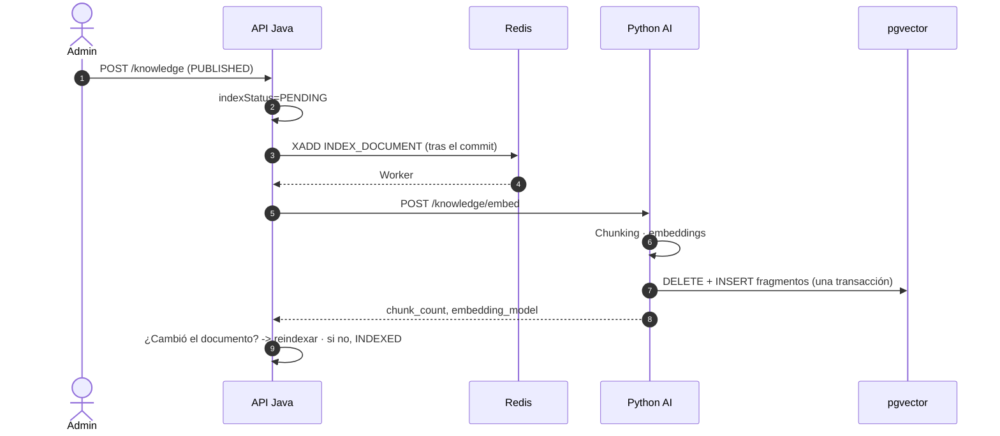

# Diagramas de secuencia

## Mensaje del cliente y respuesta de la IA en streaming

La petición del cliente termina en cuanto el mensaje está guardado; el análisis y la respuesta de la IA
ocurren después, en un worker, y llegan al navegador por SSE.



## Derivación a un humano



## Servicio de IA caído

```mermaid
sequenceDiagram
    autonumber
    participant A as API Java
    participant AI as Python AI
    actor C as Cliente

    A->>AI: POST /ai/chat (intento 1)
    AI--xA: 503 / timeout
    A->>AI: Retry (backoff exponencial, intento 2)
    AI--xA: 503 / timeout
    A->>AI: Retry (intento 3)
    AI--xA: 503 / timeout
    Note over A: CircuitBreaker registra los fallos;<br/>abierto, las llamadas fallan al instante
    A->>A: Fallback: mensaje SYSTEM "AI temporarily unavailable"
    A->>A: Derivación AI_UNAVAILABLE + ticket
    A-->>C: Un agente humano continúa la conversación
```

## Indexación de la base de conocimiento


